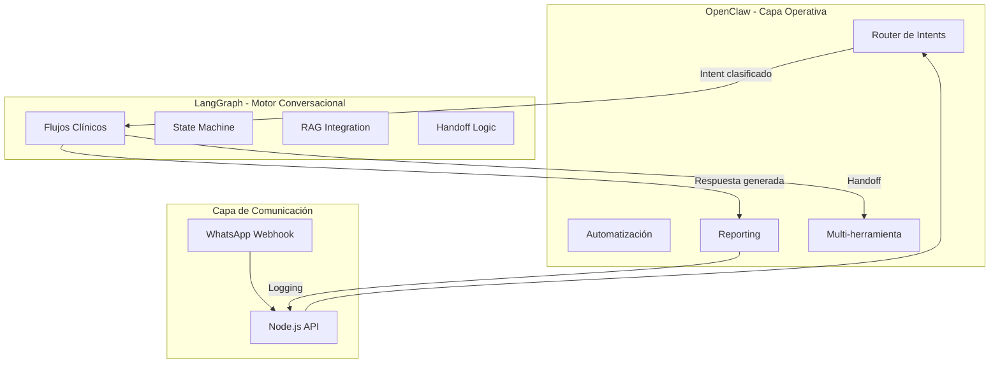
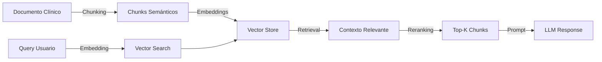
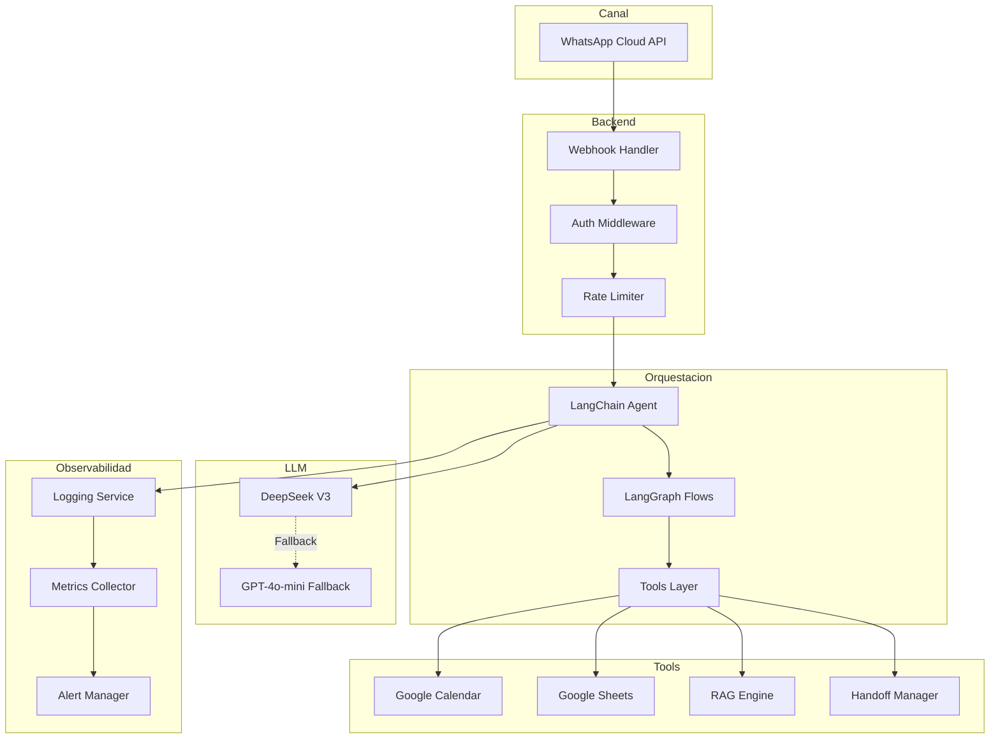
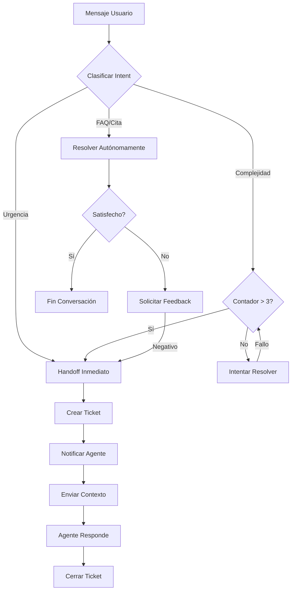
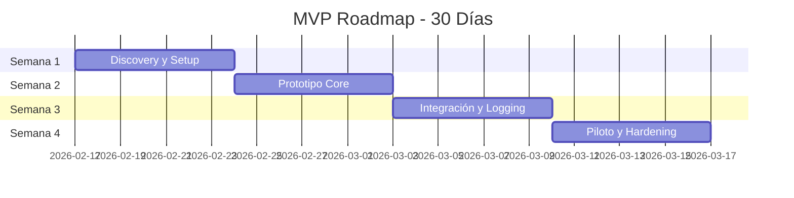
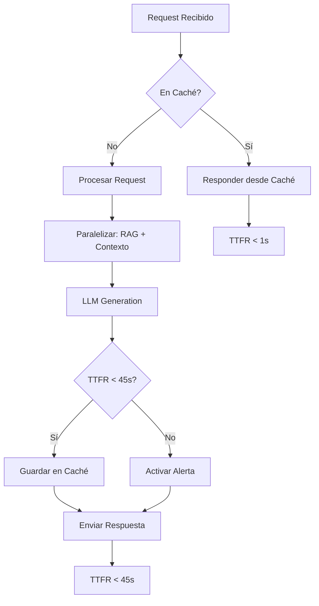
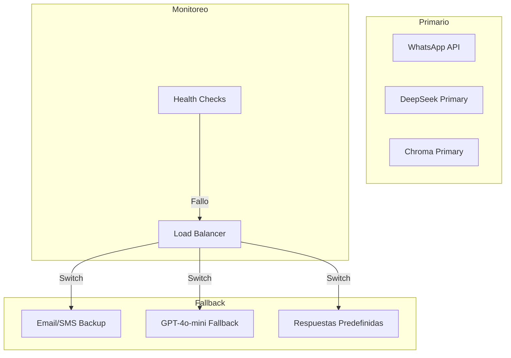
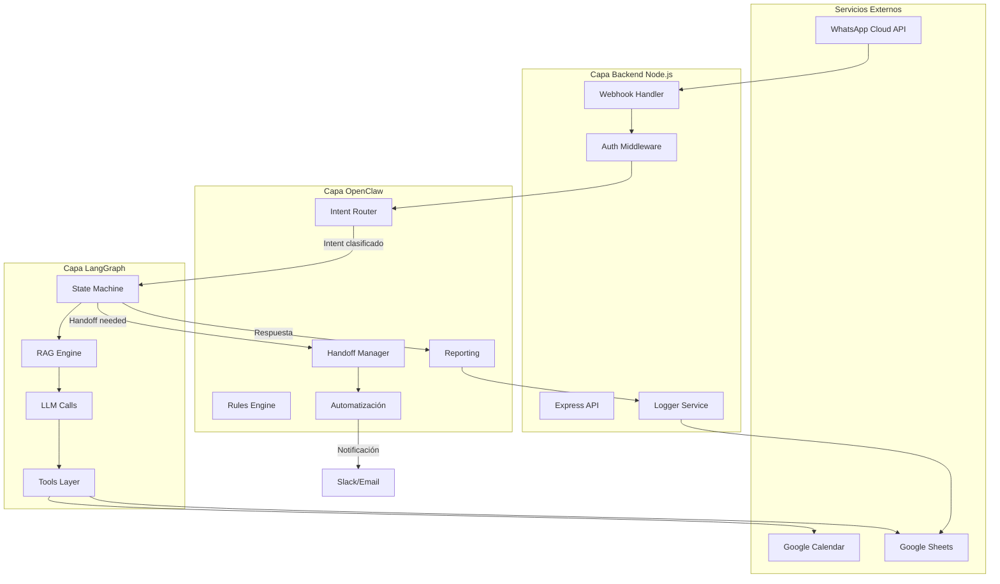
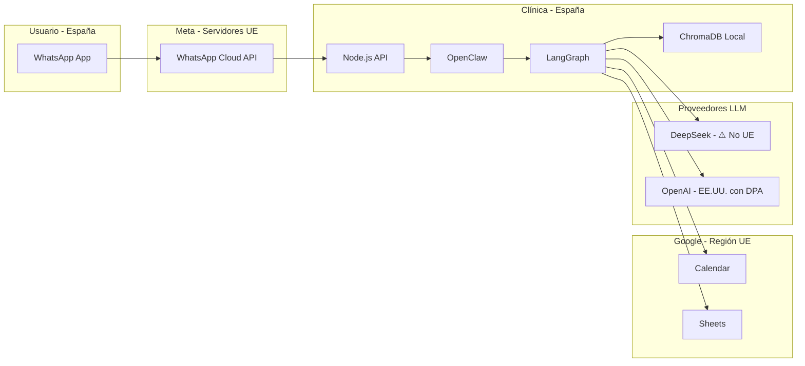
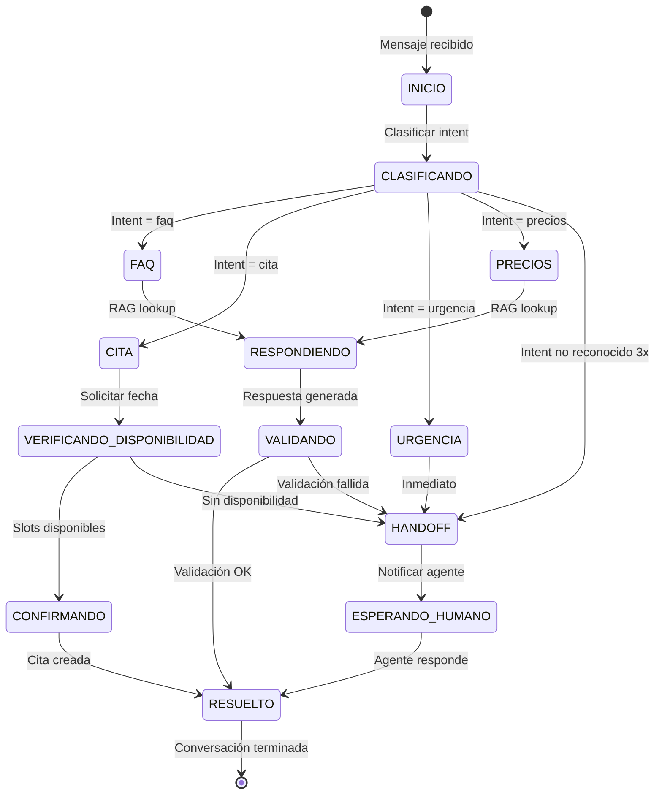

# Arquitectura del Agente Conversacional Clínico Dental

**Versión:** 1.1
**Fecha:** Febrero 2026
**Estado:** Propuesta MVP - Revisado
**Autor:** Equipo de Arquitectura

---

## Tabla de Contenidos

1. [Resumen Ejecutivo](#1-resumen-ejecutivo)
2. [Evaluación y Ajuste de Arquitectura](#2-evaluación-y-ajuste-de-arquitectura)
3. [Roadmap de 30 Días](#3-roadmap-de-30-días)
4. [Estrategia de Medición y Observabilidad](#4-estrategia-de-medición-y-observabilidad)
5. [Plan de Mitigación de Riesgos](#5-plan-de-mitigación-de-riesgos)
6. [Definition of Done Final](#6-definition-of-done-final)
7. [Anexo A: Arquitectura Híbrida OpenClaw + LangGraph](#anexo-a-arquitectura-híbrida-openclaw--langgraph)
8. [Anexo B: Data Handling Policy MVP (GDPR/LOPD)](#anexo-b-data-handling-policy-mvp-gdprlopd)
9. [Anexo C: Contratos Técnicos](#anexo-c-contratos-técnicos)
10. [Anexo D: Runbook de Incidentes](#anexo-d-runbook-de-incidentes)

---

## 1. Resumen Ejecutivo

### Objetivo North Star
**Conversación → Cita**: Maximizar la conversión de interacciones en WhatsApp hacia citas programadas en la clínica dental.

### Métricas de Éxito del MVP

| KPI | Objetivo | Rango Saludable | Medición |
|-----|----------|-----------------|----------|
| TTFR (Time To First Response) | < 60 segundos | < 45s óptimo | P95 de latencia de respuesta |
| Handoff Rate | 10-35% | ⚠️ < 10% puede indicar sobre-asunción del bot | % conversaciones escaladas a humano |
| Resolución Autónoma | > 65% | 65-90% óptimo | % conversaciones resueltas sin intervención |
| Leads Cualificados | Tracking | > 15% de conversaciones | Número de citas confirmadas |

> **Nota sobre Handoff Rate:** Un handoff rate muy bajo (< 10%) puede indicar que el bot está "asumiendo de más" y respondiendo consultas que deberían escalarse. El rango saludable para el piloto es 10-35%.

### Stack Tecnológico Propuesto

```
┌─────────────────────────────────────────────────────────────┐
│                    CANAL: WhatsApp Cloud API                │
└─────────────────────────────────────────────────────────────┘
                              │
                              ▼
┌─────────────────────────────────────────────────────────────┐
│                 ORQUESTACIÓN: OpenClaw / LangChain          │
└─────────────────────────────────────────────────────────────┘
                              │
                              ▼
┌─────────────────────────────────────────────────────────────┐
│              BACKEND: Node.js + Express + TypeScript        │
└─────────────────────────────────────────────────────────────┘
                              │
            ┌─────────────────┼─────────────────┐
            ▼                 ▼                 ▼
┌───────────────────┐ ┌───────────────┐ ┌───────────────────┐
│   Google Sheets   │ │Google Calendar│ │   RAG + LLM       │
│   (Datos/Logs)    │ │  (Citas)      │ │(DeepSeek/GLM)     │
└───────────────────┘ └───────────────┘ └───────────────────┘
                              │
                              ▼
┌─────────────────────────────────────────────────────────────┐
│              DASHBOARD: Looker Studio + Apps Script         │
└─────────────────────────────────────────────────────────────┘
```

---

## 2. Evaluación y Ajuste de Arquitectura

### 2.1 Análisis Crítico: OpenClaw como Orquestador

#### ¿Qué es OpenClaw?
OpenClaw es una plataforma de orquestación de agentes conversacionales de código abierto que permite diseñar flujos de conversación visuales y gestionar la lógica de routing entre diferentes intents.

#### Evaluación de Pros y Contras

| Aspecto | Pros | Contras | Impacto en MVP |
|---------|------|---------|----------------|
| **Curva de aprendizaje** | Interfaz visual intuitiva | Documentación limitada | ⚠️ Medio |
| **Flexibilidad** | Flujos personalizables | Complejidad para casos edge | ✅ Bajo |
| **Integraciones** | Webhooks nativos | Conectores nativos limitados | ⚠️ Medio |
| **Comunidad** | Open source activo | Menos maduro que alternativas | ⚠️ Medio |
| **Hosting** | Self-hosted (control total) | Requiere infraestructura propia | ✅ Bajo |
| **Costo** | Sin licencia | Costo de mantenimiento | ✅ Bajo |

#### Veredicto y Recomendación

**✅ Arquitectura Híbrida: OpenClaw + LangGraph**

Se recomienda una arquitectura híbrida que aprovecha las fortalezas de ambas tecnologías:



**Responsabilidades por Capa:**

| Componente | Responsabilidades | Justificación |
|------------|-------------------|---------------|
| **OpenClaw** | Router de intents, automatización, reporting, soporte multi-herramienta | Interfaz visual, fácil configuración de reglas |
| **LangGraph** | Motor conversacional clínico, state machine, RAG, handoff logic | Flujos stateful, control granular |
| **Node.js API** | Webhooks, autenticación, rate limiting, logging | Capa de integración |

**Ver Anexo A para detalles completos de la arquitectura híbrida.**

### 2.2 Análisis del RAG Básico Propuesto

#### Limitaciones del RAG con Índice Simple

| Limitación | Impacto | Solución Propuesta |
|------------|---------|-------------------|
| Sin embeddings semánticos | Búsquedas literales poco efectivas | Usar embeddings con Chroma/Pinecone |
| Sin reranking | Resultados no optimizados | Implementar reranker cross-encoder |
| Sin chunking inteligente | Contexto fragmentado | Chunking por secciones semánticas |
| Sin caché | Consultas repetidas costosas | Implementar caché semántico |

#### Arquitectura RAG Mejorada para MVP



#### Implementación Recomendada

```typescript
// Estructura del RAG Pipeline
interface RAGConfig {
  embeddingModel: 'text-embedding-3-small' | 'deepseek-embedding';
  vectorStore: 'chroma' | 'pinecone';
  chunkSize: 512;      // tokens
  chunkOverlap: 50;    // tokens
  topK: 5;             // documentos a recuperar
  rerankerEnabled: true;
  cacheEnabled: true;
}

// Documentos curados para MVP
const DOCUMENTOS_CURADOS = [
  'servicios_clinica.md',      // Lista de servicios y precios
  'faq_pacientes.md',          // Preguntas frecuentes
  'protocolos_urgencias.md',   // Cuándo derivar
  'politicas_citas.md',        // Cancelación, reprogramación
  'seguro_dental.md',          // Información de seguros
];
```

### 2.3 Stack Tecnológico Concreto Recomendado

#### Decisión Final: Stack MVP

| Componente | Tecnología | Justificación | Consideraciones GDPR |
|------------|------------|---------------|---------------------|
| **Canal** | WhatsApp Cloud API | Oficial de Meta, webhooks confiables | Datos en servidores Meta UE |
| **Orquestación** | OpenClaw + LangGraph | Híbrida: operación + flujos clínicos | Self-hosted para control total |
| **Backend** | Node.js 20 + Express + TypeScript | Ecosistema JS, rápido desarrollo | Sin datos sensibles en código |
| **Base de datos** | Google Sheets + Supabase | Sheets para MVP, Supabase para persistencia | Región UE obligatoria |
| **Calendario** | Google Calendar API | Integración nativa, familiar para clínica | Cuenta Google Workspace UE |
| **RAG** | Chroma (local) + OpenAI Embeddings | Sin costo de infraestructura externa | Datos clínicos no salen del entorno |
| **LLM** | DeepSeek V3 (primary) + GPT-4o-mini (fallback) | Costo-efectivo, buena calidad | ⚠️ Ver política de routing por riesgo |
| **Dashboard** | Looker Studio + Apps Script | Sin costo adicional, familiar | Datos anonimizados |
| **Hosting** | Railway / Render | Deploy simple, escalable | ⚠️ Región UE obligatoria |

#### Política de Hosting y Datos (GDPR/LOPD)

| Aspecto | Requisito | Implementación |
|---------|-----------|----------------|
| **Región** | UE obligatoria | Railway/Render con región Frankfurt/Dublin |
| **PHI en texto libre** | Prohibido | No almacenar mensajes de pacientes en logs |
| **Cifrado** | En tránsito y reposo | HTTPS + cifrado de volúmenes |
| **Retención** | Mínima necesaria | 90 días para logs, 2 años para leads |
| **Borrado** | Derecho al olvido | Endpoint de eliminación bajo solicitud |

#### Política de Routing LLM por Riesgo

```typescript
// src/config/llm-routing.ts
interface LLMRoutingConfig {
  // Consultas de bajo riesgo: DeepSeek (costo-efectivo)
  lowRisk: {
    intents: ['faq_general', 'horarios', 'ubicacion', 'servicios'];
    model: 'deepseek-chat';
    maxTokens: 500;
  };
  
  // Consultas de medio riesgo: DeepSeek con validación
  mediumRisk: {
    intents: ['precios', 'citas', 'seguros'];
    model: 'deepseek-chat';
    validation: true;
    maxTokens: 800;
  };
  
  // Consultas de alto riesgo: GPT-4o-mini (más robusto)
  highRisk: {
    intents: ['urgencia', 'queja', 'datos_sensibles'];
    model: 'gpt-4o-mini';
    validation: true;
    handoffOnLowConfidence: true;
    confidenceThreshold: 0.85;
  };
}
```

> **⚠️ Nota sobre DeepSeek:** Para datos clínicos reales, validar política de retención/procesamiento del proveedor. Considera DPA (Data Processing Agreement) si está disponible, o usar solo para consultas no sensibles.

#### Diagrama de Arquitectura Detallado



### 2.4 Arquitectura de Handoff Humano

#### Criterios de Escalación

| Criterio | Detección | Acción |
|----------|-----------|--------|
| **Urgencia médica** | Keywords + NLP | Escalación inmediata + alerta |
| **Complejidad alta** | Intent no reconocido 3x | Escalación con contexto |
| **Solicitud explícita** | "Hablar con humano" | Escalación con resumen |
| **Sentimiento negativo** | Análisis de sentimiento | Escalación preventiva |
| **Consulta fuera de scope** | Clasificación de intent | Escalación con sugerencia |

#### Flujo de Handoff



#### Implementación del Handoff

```typescript
interface HandoffRequest {
  conversationId: string;
  userId: string;
  reason: HandoffReason;
  priority: 'low' | 'medium' | 'high' | 'urgent';
  context: ConversationContext;
  summary: string;
  suggestedResponse?: string;
}

enum HandoffReason {
  MEDICAL_URGENCY = 'medical_urgency',
  COMPLEXITY = 'complexity',
  USER_REQUEST = 'user_request',
  NEGATIVE_SENTIMENT = 'negative_sentiment',
  OUT_OF_SCOPE = 'out_of_scope',
}

// Notificación al equipo
async function notifyHandoff(request: HandoffRequest): Promise<void> {
  // 1. Crear registro en Sheets
  await logHandoffToSheets(request);
  
  // 2. Enviar notificación (Slack/Email/WhatsApp Business)
  await sendNotification({
    channel: 'slack',
    message: `🚨 Handoff ${request.priority}: ${request.reason}`,
    data: request,
  });
  
  // 3. Enviar mensaje al usuario
  await sendWhatsAppMessage(
    request.userId,
    'Te estoy conectando con nuestro equipo. Un momento por favor...'
  );
}
```

---

## 3. Roadmap de 30 Días

### Visión General



---

### SEMANA 1: Discovery + Setup de Infraestructura

#### Objetivos de la Semana
- Configurar infraestructura base
- Definir flujos conversacionales principales
- Preparar documentos para RAG

#### Desglose Diario

| Día | Tareas | Entregable | DoD |
|-----|--------|------------|-----|
| **Lunes** | Setup proyecto Node.js + TS | Repo inicial con estructura | `npm run dev` funciona |
| **Lunes** | Configurar ESLint, Prettier, Husky | Linting automático | Pre-commit hooks activos |
| **Martes** | WhatsApp Cloud API setup | Webhook verificado | Mensaje de prueba recibido |
| **Martes** | Configurar variables de entorno | `.env.example` documentado | Secrets en vault |
| **Miércoles** | Diseñar flujos conversacionales | Diagramas en Mermaid | 5 flujos principales documentados |
| **Miércoles** | Crear documentos curados | 5 archivos markdown | Contenido validado por clínica |
| **Jueves** | Setup Chroma vector store | Instancia local corriendo | Embeddings generados |
| **Jueves** | Implementar RAG básico | Query retorna contexto | Test con 10 queries |
| **Viernes** | Configurar Google Cloud Project | APIs habilitadas | Service account creado |
| **Viernes** | Test de integración Calendar API | CRUD de eventos funciona | Crear/leer/actualizar/borrar |

#### Checklist Semana 1

```markdown
- [ ] Repositorio GitHub creado con estructura estándar
- [ ] CI/CD básico configurado (GitHub Actions)
- [ ] WhatsApp Business Account verificada
- [ ] Webhook de WhatsApp funcionando en desarrollo
- [ ] Flujos conversacionales documentados y aprobados
- [ ] Documentos curados creados y validados
- [ ] Vector store operativo con embeddings
- [ ] Google Calendar API integrada
- [ ] Google Sheets API integrada
- [ ] Variables de entorno documentadas
```

---

### SEMANA 2: Prototipo Técnico - Core Flows

#### Objetivos de la Semana
- Implementar agente conversacional básico
- Desarrollar flujos principales de cita
- Integrar LLM con RAG

#### Desglose Diario

| Día | Tareas | Entregable | DoD |
|-----|--------|------------|-----|
| **Lunes** | Implementar LangChain Agent | Agente responde queries básicas | 5 intents funcionando |
| **Lunes** | Configurar DeepSeek API | LLM respondiendo | Latencia < 5s |
| **Martes** | Implementar flujo de bienvenida | Mensaje de bienvenida contextual | A/B test preparado |
| **Martes** | Implementar clasificación de intents | 90% precisión en test set | 50 ejemplos de test |
| **Miércoles** | Flujo: Consultar servicios | RAG + respuesta estructurada | 10 servicios cubiertos |
| **Miércoles** | Flujo: Ver disponibilidad | Integración Calendar | Horarios en tiempo real |
| **Jueves** | Flujo: Agendar cita | Crear evento en Calendar | Cita aparece en calendario |
| **Jueves** | Flujo: Cancelar/reprogramar | Modificar eventos | Confirmación enviada |
| **Viernes** | Implementar handoff básico | Escalación a humano | Notificación Slack |
| **Viernes** | Test de integración E2E | 3 flujos completos | Sin errores críticos |

#### Código: Estructura del Agente

```typescript
// src/agent/dental-agent.ts
import { ChatOpenAI } from '@langchain/openai';
import { AgentExecutor, createOpenAIFunctionsAgent } from 'langchain/agents';
import { Chroma } from '@langchain/community/vectorstores/chroma';
import { OpenAIEmbeddings } from '@langchain/openai';

const tools = [
  new SearchServicesTool(),      // RAG sobre servicios
  new CheckAvailabilityTool(),   // Google Calendar
  new BookAppointmentTool(),     // Crear cita
  new CancelAppointmentTool(),   // Cancelar cita
  new HandoffToHumanTool(),      // Escalar
];

export async function createDentalAgent() {
  const llm = new ChatOpenAI({
    modelName: 'deepseek-chat',
    temperature: 0.1,
  });
  
  const agent = await createOpenAIFunctionsAgent({
    llm,
    tools,
    prompt: DENTAL_SYSTEM_PROMPT,
  });
  
  return new AgentExecutor({ agent, tools });
}
```

#### Checklist Semana 2

```markdown
- [ ] LangChain Agent operativo
- [ ] DeepSeek/GPT-4o-mini integrado
- [ ] 5 intents principales funcionando
- [ ] RAG respondiendo con contexto relevante
- [ ] Flujo de agendar cita E2E
- [ ] Flujo de cancelar/reprogramar E2E
- [ ] Handoff básico implementado
- [ ] Tests unitarios > 70% coverage
- [ ] Documentación de API interna
```

---

### SEMANA 3: Integración + Logging + Dashboard

#### Objetivos de la Semana
- Implementar logging comprehensivo
- Crear dashboard de métricas
- Automatizar reportes

#### Desglose Diario

| Día | Tareas | Entregable | DoD |
|-----|--------|------------|-----|
| **Lunes** | Diseñar esquema de eventos | 15 eventos definidos | Documento aprobado |
| **Lunes** | Implementar logger centralizado | Winston/Pino configurado | Logs en CloudWatch |
| **Martes** | Integrar logging en todos los flujos | Cada acción genera evento | Trazabilidad completa |
| **Martes** | Crear estructura en Google Sheets | 5 hojas con formato | Fórmulas funcionando |
| **Miércoles** | Implementar sincronización logs→Sheets | Apps Script desplegado | Datos actualizados |
| **Miércoles** | Diseñar dashboard Looker Studio | Mockup aprobado | 6 widgets principales |
| **Jueves** | Conectar Looker a Sheets | Dashboard funcional | Actualización en tiempo real |
| **Jueves** | Implementar alertas básicas | Email/Slack configurado | Alerta de TTFR > 60s |
| **Viernes** | Crear reporte semanal automático | Apps Script generador | Email enviado |
| **Viernes** | Documentar runbook operacional | Runbook completo | Procedimientos claros |

#### Esquema de Eventos

```typescript
interface ConversationEvent {
  eventId: string;
  timestamp: Date;
  eventType: EventType;
  conversationId: string;
  userId: string;
  data: Record<string, unknown>;
  metadata: {
    latency?: number;
    model?: string;
    tokensUsed?: number;
    error?: string;
  };
}

enum EventType {
  // Conversación
  CONVERSATION_STARTED = 'conversation_started',
  CONVERSATION_ENDED = 'conversation_ended',
  MESSAGE_RECEIVED = 'message_received',
  MESSAGE_SENT = 'message_sent',
  
  // Intents
  INTENT_CLASSIFIED = 'intent_classified',
  INTENT_MISSED = 'intent_missed',
  
  // Acciones
  APPOINTMENT_CREATED = 'appointment_created',
  APPOINTMENT_CANCELLED = 'appointment_cancelled',
  APPOINTMENT_RESCHEDULED = 'appointment_rescheduled',
  
  // Handoff
  HANDOFF_REQUESTED = 'handoff_requested',
  HANDOFF_COMPLETED = 'handoff_completed',
  
  // Sistema
  ERROR_OCCURRED = 'error_occurred',
  LATENCY_WARNING = 'latency_warning',
}
```

#### Checklist Semana 3

```markdown
- [ ] Logger centralizado operativo
- [ ] 15 tipos de eventos capturados
- [ ] Google Sheets con estructura definida
- [ ] Sincronización automática funcionando
- [ ] Dashboard Looker Studio conectado
- [ ] 6 widgets de métricas visibles
- [ ] Alertas configuradas (TTFR, errores)
- [ ] Reporte semanal automatizado
- [ ] Runbook operacional documentado
```

---

### SEMANA 4: Piloto Controlado + Hardening

#### Objetivos de la Semana
- Validar con usuarios reales
- Optimizar rendimiento
- Preparar para producción

#### Desglose Diario

| Día | Tareas | Entregable | DoD |
|-----|--------|------------|-----|
| **Lunes** | Desplegar a staging | Ambiente de pruebas | URL accesible |
| **Lunes** | Configurar monitoreo | Health checks activos | Alertas funcionando |
| **Martes** | Piloto interno (5 usuarios) | Feedback recopilado | 20 conversaciones |
| **Martes** | Ajustar prompts según feedback | Prompts optimizados | Mejor precisión |
| **Miércoles** | Piloto externo (10 pacientes) | Métricas de piloto | KPIs medidos |
| **Miércoles** | Fix bugs críticos | Sin bugs bloqueantes | Tests pasando |
| **Jueves** | Optimizar latencia | TTFR < 45s (P95) | Métricas mejoradas |
| **Jueves** | Implementar rate limiting | Protección anti-abuso | Límites configurados |
| **Viernes** | Despliegue a producción | Bot activo 24/7 | Monitoreo activo |
| **Viernes** | Documentación final | README + API docs | Onboarding claro |

#### Criterios de Aceptación del Piloto

| Métrica | Objetivo Piloto | Objetivo MVP |
|---------|-----------------|--------------|
| TTFR P95 | < 60s | < 45s |
| Precisión de intents | > 85% | > 90% |
| Resolución autónoma | > 60% | > 70% |
| Handoff rate | < 25% | < 20% |
| Satisfacción usuario | > 4.0/5 | > 4.5/5 |

#### Checklist Semana 4

```markdown
- [ ] Ambiente de staging operativo
- [ ] Piloto interno completado
- [ ] Piloto externo completado
- [ ] Bugs críticos resueltos
- [ ] Latencia optimizada (TTFR < 60s)
- [ ] Rate limiting implementado
- [ ] Desplegado en producción
- [ ] Monitoreo 24/7 activo
- [ ] Documentación completa
- [ ] Handoff a equipo operativo
```

---

## 4. Estrategia de Medición y Observabilidad

### 4.1 Arquitectura de Logging

#### Stack de Observabilidad

```
┌─────────────────────────────────────────────────────────────┐
│                    APLICACIÓN NODE.JS                       │
│  ┌─────────────┐  ┌─────────────┐  ┌─────────────┐        │
│  │   Winston   │  │   Metrics   │  │   Tracing   │        │
│  │   Logger    │  │  Collector  │  │   (OTEL)    │        │
│  └──────┬──────┘  └──────┬──────┘  └──────┬──────┘        │
└─────────┼────────────────┼────────────────┼────────────────┘
          │                │                │
          ▼                ▼                ▼
┌─────────────────┐ ┌─────────────┐ ┌─────────────────┐
│  CloudWatch     │ │  Prometheus │ │   Jaeger        │
│  Logs           │ │  (Metrics)  │ │   (Traces)      │
└─────────────────┘ └──────┬──────┘ └─────────────────┘
                          │
                          ▼
                   ┌─────────────┐
                   │  Grafana    │
                   │  Dashboard  │
                   └─────────────┘
```

#### Eventos a Capturar

| Categoría | Evento | Datos Capturados |
|-----------|--------|------------------|
| **Conversación** | `message_received` | userId, message, timestamp, channel |
| **Conversación** | `message_sent` | userId, response, latency, tokens |
| **Conversación** | `conversation_started` | userId, source, referrer |
| **Conversación** | `conversation_ended` | userId, duration, resolution_status |
| **Intent** | `intent_classified` | intent, confidence, message |
| **Intent** | `intent_missed` | message, suggested_intent |
| **Cita** | `appointment_created` | userId, date, time, service |
| **Cita** | `appointment_cancelled` | userId, appointment_id, reason |
| **Handoff** | `handoff_requested` | userId, reason, priority |
| **Handoff** | `handoff_completed` | userId, agent_id, duration |
| **Sistema** | `error_occurred` | error_type, message, stack_trace |
| **Sistema** | `latency_warning` | operation, latency_ms |

### 4.2 Definición de KPIs

#### KPIs Principales (North Star)

| KPI | Definición | Fórmula | Objetivo | Rango Saludable | Frecuencia |
|-----|------------|---------|----------|-----------------|------------|
| **TTFR** | Tiempo hasta primera respuesta | P95(latencia respuesta) | < 60s | < 45s óptimo | Tiempo real |
| **Handoff Rate** | % conversaciones escaladas | handoffs / total_conversaciones | 10-35% | ⚠️ < 10% = sobre-asunción | Diario |
| **Resolución Autónoma** | % resuelto sin humano | 1 - handoff_rate | > 65% | 65-90% óptimo | Diario |
| **Conversión a Cita** | % conversaciones con cita | citas_creadas / conversaciones | > 15% | > 20% excelente | Semanal |

#### Criterio de Salida para Handoff Rate

| Handoff Rate | Interpretación | Acción |
|--------------|----------------|--------|
| **< 10%** | ⚠️ Bot posiblemente asumiendo de más | Revisar logs de respuestas, validar calidad |
| **10-35%** | ✅ Rango saludable | Mantener monitoreo |
| **> 35%** | ⚠️ Posibles problemas de clasificación | Revisar intents, mejorar RAG |
| **> 50%** | ❌ Sistema no funcionando efectivamente | Revisar arquitectura, pausar piloto |

#### KPIs Secundarios

| KPI | Definición | Objetivo | Acción si falla |
|-----|------------|----------|-----------------|
| **Precisión de Intent** | % intents correctamente clasificados | > 90% | Reentrenar clasificador |
| **Cobertura de FAQ** | % FAQs respondidas correctamente | > 95% | Ampliar documentos RAG |
| **Tiempo de Resolución** | Duración promedio de conversación | < 5 min | Optimizar flujos |
| **Satisfacción (NPS)** | Rating post-conversación | > 4.0/5 | Ajustar respuestas |
| **Costo por Conversación** | Gasto LLM por interacción | < €0.05 | Optimizar prompts/tokens |

### 4.3 Estructura del Dashboard Looker Studio

#### Layout del Dashboard

```
┌─────────────────────────────────────────────────────────────────┐
│  DASHBOARD AGENTE DENTAL - MÉTRICAS EN TIEMPO REAL              │
├─────────────────────────────────────────────────────────────────┤
│  ┌──────────────┐  ┌──────────────┐  ┌──────────────┐          │
│  │   TTFR       │  │  HANDOFF     │  │  RESOLUCIÓN  │          │
│  │   45.2s      │  │   15.3%      │  │   84.7%      │          │
│  │   ✅ OK      │  │   ✅ OK      │  │   ✅ OK      │          │
│  └──────────────┘  └──────────────┘  └──────────────┘          │
├─────────────────────────────────────────────────────────────────┤
│  CONVERSACIONES POR DÍA                                          │
│  ┌──────────────────────────────────────────────────────────┐   │
│  │    📊 Gráfico de líneas - Últimos 30 días                │   │
│  │    Eje Y: Número conversaciones                          │   │
│  │    Eje X: Fecha                                          │   │
│  │    Líneas: Totales, Resueltas, Escaladas                 │   │
│  └──────────────────────────────────────────────────────────┘   │
├─────────────────────────────────────────────────────────────────┤
│  DISTRIBUCIÓN DE INTENTS          │  CITAS POR SERVICIO         │
│  ┌────────────────────────────┐   │  ┌────────────────────────┐ │
│  │  🥧 Pie chart              │   │  │  📊 Bar chart          │ │
│  │  - Agendar cita: 35%       │   │  │  - Limpieza: 45        │ │
│  │  - Consultar precio: 25%   │   │  │  - Ortodoncia: 32      │ │
│  │  - Cancelar: 15%           │   │  │  - Implantes: 18       │ │
│  │  - FAQ: 20%                │   │  │  - Blanqueamiento: 28  │ │
│  │  - Otros: 5%               │   │  └────────────────────────┘ │
│  └────────────────────────────┘   │                             │
├─────────────────────────────────────────────────────────────────┤
│  LATENCIA POR COMPONENTE (P95)    │  ERRORES ÚLTIMAS 24H        │
│  ┌────────────────────────────┐   │  ┌────────────────────────┐ │
│  │  LLM: 3.2s                 │   │  │  Total: 12             │ │
│  │  RAG: 0.8s                 │   │  │  - Timeout: 5          │ │
│  │  Calendar API: 1.1s        │   │  │  - Rate limit: 4       │ │
│  │  Total: 5.1s               │   │  │  - Otros: 3            │ │
│  └────────────────────────────┘   │  └────────────────────────┘ │
└─────────────────────────────────────────────────────────────────┘
```

#### Filtros Disponibles
- Rango de fechas
- Tipo de intent
- Estado de resolución
- Usuario/Agente

### 4.4 Formato del Reporte Semanal Automatizado

#### Estructura del Email

```markdown
📊 REPORTE SEMANAL - AGENTE CONVERSACIONAL DENTAL
Período: [Fecha inicio] - [Fecha fin]

═══════════════════════════════════════════════════════════════
📈 RESUMEN EJECUTIVO
═══════════════════════════════════════════════════════════════

| Métrica              | Esta Semana | Semana Anterior | Cambio |
|----------------------|-------------|-----------------|--------|
| Conversaciones       | 234         | 198             | +18%   |
| TTFR (P95)          | 48s         | 52s             | -8%    |
| Handoff Rate        | 16%         | 19%             | -16%   |
| Resolución Autónoma | 84%         | 81%             | +4%    |
| Citas Agendadas     | 42          | 35              | +20%   |

═══════════════════════════════════════════════════════════════
🎯 OBJETIVOS vs REALIDAD
═══════════════════════════════════════════════════════════════

✅ TTFR < 60s: CUMPLIDO (48s)
✅ Handoff < 20%: CUMPLIDO (16%)
✅ Resolución > 70%: CUMPLIDO (84%)
⚠️ Conversión > 15%: POR MEJORAR (14.5%)

═══════════════════════════════════════════════════════════════
🏆 TOP INTENTS DE LA SEMANA
═══════════════════════════════════════════════════════════════

1. Agendar cita: 82 conversaciones (35%)
2. Consultar precios: 58 conversaciones (25%)
3. Preguntas frecuentes: 47 conversaciones (20%)
4. Cancelar cita: 35 conversaciones (15%)
5. Otros: 12 conversaciones (5%)

═══════════════════════════════════════════════════════════════
⚠️ ALERTAS Y RECOMENDACIONES
═══════════════════════════════════════════════════════════════

• 5 intents no reconocidos relacionados con "implantes dentales"
  → Recomendación: Añadir documento sobre implantes al RAG

• Pico de latencia el miércoles 14:00-15:00 (TTFR: 78s)
  → Recomendación: Revisar carga del servidor en horario punta

• 3 quejas sobre respuestas sobre seguros
  → Recomendación: Revisar y actualizar información de seguros

═══════════════════════════════════════════════════════════════
📅 PRÓXIMOS PASOS
═══════════════════════════════════════════════════════════════

1. Añadir documento de implantes al RAG
2. Optimizar prompts para reducir tokens
3. Revisar flujo de seguros con la clínica

---
Generado automáticamente | Dashboard completo: [Link Looker]
```

---

## 5. Plan de Mitigación de Riesgos

### 5.1 Matriz de Riesgos

| ID | Riesgo | Probabilidad | Impacto | Severidad | Categoría |
|----|--------|--------------|---------|-----------|-----------|
| R1 | Latencia alta (TTFR > 60s) | Media | Alto | **Alta** | Técnico |
| R2 | Alucinaciones en contexto clínico | Baja | Muy Alto | **Alta** | Calidad |
| R3 | Caída del servicio de WhatsApp | Baja | Alto | **Media** | Infraestructura |
| R4 | Fallo en API de Google Calendar | Media | Medio | **Media** | Integración |
| R5 | Costo de LLM excesivo | Media | Medio | **Media** | Financiero |
| R6 | Baja precisión de intents | Media | Alto | **Alta** | Calidad |
| R7 | Incumplimiento GDPR/LOPD | Baja | Muy Alto | **Alta** | Legal |
| R8 | Handoff no atendido | Media | Alto | **Alta** | Operativo |

#### Matriz Visual de Severidad

```
                    IMPACTO
              Bajo    Medio    Alto    Muy Alto
         ┌────────┬────────┬────────┬────────┐
    Alto │        │   R5   │   R1   │        │
PROB     ├────────┼────────┼────────┼────────┤
   Medio │        │   R4   │   R6   │   R2   │
         ├────────┼────────┼────────┼────────┤
    Bajo │        │        │   R3   │   R7   │
         └────────┴────────┴────────┴────────┘
```

### 5.2 Mitigación Específica: Latencia Alta (TTFR > 60s)

#### Causas Raíz Identificadas

| Causa | Contribución | Solución |
|-------|--------------|----------|
| Latencia LLM | 60% | Caché de respuestas, modelo más rápido |
| Latencia RAG | 20% | Índice optimizado, embeddings cacheados |
| Latencia APIs externas | 15% | Requests paralelos, timeout configurado |
| Procesamiento propio | 5% | Optimización de código |

#### Estrategia de Mitigación



#### Implementación de Caché

```typescript
// src/cache/response-cache.ts
import { Redis } from 'ioredis';
import { createHash } from 'crypto';

const redis = new Redis(process.env.REDIS_URL);
const CACHE_TTL = 3600; // 1 hora

export async function getCachedResponse(
  query: string,
  context: string
): Promise<string | null> {
  const key = createHash('sha256')
    .update(query + context)
    .digest('hex');
  
  return redis.get(`response:${key}`);
}

export async function cacheResponse(
  query: string,
  context: string,
  response: string
): Promise<void> {
  const key = createHash('sha256')
    .update(query + context)
    .digest('hex');
  
  await redis.setex(`response:${key}`, CACHE_TTL, response);
}
```

#### Configuración de Timeouts

```typescript
// src/config/timeout.config.ts
export const TIMEOUT_CONFIG = {
  llm: {
    default: 30000,      // 30s
    streaming: 45000,    // 45s
    fallback: 15000,     // 15s para fallback model
  },
  rag: {
    search: 5000,        // 5s
    embedding: 3000,     // 3s
  },
  calendar: {
    read: 5000,          // 5s
    write: 10000,        // 10s
  },
  sheets: {
    read: 5000,
    write: 10000,
  },
};
```

### 5.3 Mitigación Específica: Alucinaciones en Contexto Clínico

#### Estrategia de Defensa en Profundidad

```
┌─────────────────────────────────────────────────────────────┐
│                    CAPA 1: PROMPT ENGINEERING               │
│  - Instrucciones explícitas de no inventar información      │
│  - Respuestas estructuradas con fuentes                     │
└─────────────────────────────────────────────────────────────┘
                              │
                              ▼
┌─────────────────────────────────────────────────────────────┐
│                    CAPA 2: RAG CON CITAS                    │
│  - Solo responder con información de documentos curados     │
│  - Indicar cuando no hay información disponible             │
└─────────────────────────────────────────────────────────────┘
                              │
                              ▼
┌─────────────────────────────────────────────────────────────┐
│                    CAPA 3: VALIDACIÓN DE OUTPUT             │
│  - Verificar coherencia con documentos fuente               │
│  - Detectar afirmaciones médicas no verificadas             │
└─────────────────────────────────────────────────────────────┘
                              │
                              ▼
┌─────────────────────────────────────────────────────────────┐
│                    CAPA 4: ESCALACIÓN AUTOMÁTICA            │
│  - Handoff para consultas médicas complejas                 │
│  - Disclaimer automático en respuestas clínicas             │
└─────────────────────────────────────────────────────────────┘
```

#### Prompt con Guardrails

```typescript
// src/prompts/dental-system-prompt.ts
export const DENTAL_SYSTEM_PROMPT = `
Eres un asistente virtual de una clínica dental. Tu objetivo es ayudar 
a los pacientes con consultas generales y gestionar citas.

REGLAS ESTRICTAS:
1. SOLO responde con información que esté explícitamente en los documentos proporcionados
2. NUNCA inventes precios, tratamientos, o información médica
3. Si no tienes información, di: "No tengo esa información disponible. 
   ¿Te gustaría que te conecte con nuestro equipo?"
4. Para cualquier consulta sobre diagnóstico o tratamiento médico, 
   responde: "Esta consulta requiere evaluación profesional. 
   Te conectaré con nuestro equipo médico."
5. Siempre incluye un disclaimer en respuestas sobre tratamientos:
   "Esta información es orientativa. Un profesional debe evaluar tu caso específico."

CONTEXTO DISPONIBLE:
{context}

HISTORIAL DE CONVERSACIÓN:
{chat_history}

PREGUNTA DEL PACIENTE:
{question}

RESPUESTA (siguiendo las reglas estrictas):
`;
```

#### Validador de Output

```typescript
// src/validators/output-validator.ts
interface ValidationResult {
  isValid: boolean;
  issues: string[];
  shouldHandoff: boolean;
}

const MEDICAL_KEYWORDS = [
  'diagnóstico', 'tratamiento', 'medicamento', 'dosis',
  'cirugía', 'anestesia', 'complicación', 'infección',
];

const UNCERTAINTY_PHRASES = [
  'creo que', 'posiblemente', 'tal vez', 'podría ser',
  'no estoy seguro', 'quizás',
];

export function validateMedicalOutput(response: string): ValidationResult {
  const issues: string[] = [];
  let shouldHandoff = false;
  
  // Detectar keywords médicos sin disclaimer
  const hasMedicalContent = MEDICAL_KEYWORDS.some(
    kw => response.toLowerCase().includes(kw)
  );
  
  if (hasMedicalContent && !response.includes('evaluación profesional')) {
    issues.push('Contenido médico sin disclaimer apropiado');
    shouldHandoff = true;
  }
  
  // Detectar frases de incertidumbre
  const hasUncertainty = UNCERTAINTY_PHRASES.some(
    phrase => response.toLowerCase().includes(phrase)
  );
  
  if (hasUncertainty) {
    issues.push('Respuesta contiene incertidumbre');
    shouldHandoff = true;
  }
  
  return {
    isValid: issues.length === 0,
    issues,
    shouldHandoff,
  };
}
```

### 5.4 Plan de Contingencia para Caídas de Servicio

#### Escenarios de Fallo y Respuesta

| Escenario | Detección | Respuesta Automática | Tiempo Recuperación |
|-----------|-----------|---------------------|---------------------|
| WhatsApp API down | Health check falla | Mensaje en canal alternativo | 5-15 min |
| LLM timeout | Timeout > 45s | Fallback a modelo más rápido | < 1 min |
| Vector store down | Query falla | Respuesta sin RAG (limitada) | < 30s |
| Calendar API down | Error 5xx | Mensaje de "sistema temporalmente no disponible" | < 1 min |
| Backend crash | Process exit | Auto-restart (PM2/K8s) | < 30s |

#### Arquitectura de Resiliencia



#### Configuración de Circuit Breaker

```typescript
// src/resilience/circuit-breaker.ts
import CircuitBreaker from 'opossum';

const llmBreaker = new CircuitBreaker(callLLM, {
  timeout: 45000,           // 45s timeout
  errorThresholdPercentage: 50,  // 50% errores abre circuito
  resetTimeout: 30000,      // 30s antes de intentar cerrar
});

llmBreaker.fallback(() => {
  // Fallback a modelo más rápido
  return callFallbackLLM();
});

llmBreaker.on('open', () => {
  logger.warn('Circuit breaker OPEN - usando fallback LLM');
  alerting.send({ type: 'circuit_open', service: 'llm' });
});
```

---

## 6. Definition of Done Final

### Checklist de Validación MVP

#### Funcionalidad Core

```markdown
## Gestión de Conversaciones
- [ ] El bot responde a mensajes de WhatsApp en < 60s (P95)
- [ ] El bot mantiene contexto de conversación (mínimo 10 turnos)
- [ ] El bot maneja múltiples usuarios simultáneamente
- [ ] El bot detecta y maneja intents principales con > 90% precisión
- [ ] El bot responde FAQs con información de documentos curados

## Gestión de Citas
- [ ] El bot puede verificar disponibilidad en Google Calendar
- [ ] El bot puede crear citas en Google Calendar
- [ ] El bot puede cancelar citas existentes
- [ ] El bot puede reprogramar citas
- [ ] El bot envía confirmación de citas por WhatsApp
- [ ] Las citas creadas aparecen en el calendario de la clínica

## Handoff Humano
- [ ] El bot detecta urgencias médicas y escala automáticamente
- [ ] El bot detecta complejidad alta y escala después de 3 intentos
- [ ] El bot detecta solicitud explícita de humano
- [ ] El bot envía notificación al equipo cuando escala
- [ ] El bot proporciona contexto completo al agente humano
- [ ] El handoff rate es < 20%
```

#### Calidad y Rendimiento

```markdown
## Métricas de Rendimiento
- [ ] TTFR P95 < 60 segundos
- [ ] TTFR P99 < 90 segundos
- [ ] Tiempo de respuesta del LLM < 5 segundos (P95)
- [ ] Tiempo de búsqueda RAG < 2 segundos (P95)
- [ ] Tiempo de API de Calendar < 3 segundos (P95)

## Calidad de Respuestas
- [ ] Precisión de clasificación de intents > 90%
- [ ] Cobertura de FAQs > 95%
- [ ] Sin alucinaciones en respuestas médicas (validado en 100 tests)
- [ ] Disclaimer incluido en respuestas sobre tratamientos
- [ ] Respuestas coherentes con documentos fuente

## Resiliencia
- [ ] Fallback a modelo secundario funciona
- [ ] Circuit breaker configurado y probado
- [ ] Rate limiting implementado
- [ ] Health checks funcionando
- [ ] Auto-restart en caso de crash
```

#### Observabilidad

```markdown
## Logging
- [ ] Todos los eventos definidos se capturan
- [ ] Logs estructurados en formato JSON
- [ ] Logs accesibles en CloudWatch o equivalente
- [ ] Trazabilidad completa de conversaciones
- [ ] PII enmascarado en logs

## Métricas
- [ ] Dashboard Looker Studio conectado
- [ ] KPIs principales visibles en tiempo real
- [ ] Alertas configuradas para TTFR > 60s
- [ ] Alertas configuradas para errores > 5/hora
- [ ] Reporte semanal automatizado funcionando

## Monitoreo
- [ ] Health check endpoint disponible
- [ ] Alertas enviadas a Slack/Email
- [ ] Runbook operacional documentado
- [ ] On-call definido para emergencias
```

#### Compliance y Seguridad

```markdown
## GDPR/LOPD
- [ ] Política de privacidad accesible desde el bot
- [ ] Consentimiento explícito para procesar datos
- [ ] Derecho al olvido implementado (borrado de datos)
- [ ] Datos personales encriptados en tránsito
- [ ] Datos personales encriptados en reposo
- [ ] Logs de acceso a datos personales
- [ ] Retención de datos definida (máx 2 años)
- [ ] Proveedor de LLM con DPA (Data Processing Agreement)

## Seguridad
- [ ] Webhooks verificados con firma de WhatsApp
- [ ] API keys almacenadas en vault/secrets manager
- [ ] Rate limiting para prevenir abuso
- [ ] Input sanitization implementado
- [ ] Sin datos sensibles en código fuente
```

#### Documentación y Handoff

```markdown
## Documentación Técnica
- [ ] README con setup completo
- [ ] Documentación de API interna
- [ ] Diagramas de arquitectura actualizados
- [ ] Guía de troubleshooting
- [ ] Runbook operacional

## Documentación de Negocio
- [ ] Manual de usuario para la clínica
- [ ] Guía de handoff a humano
- [ ] Procedimientos de escalamiento
- [ ] FAQ del equipo sobre el bot

## Código
- [ ] Código revisado y aprobado
- [ ] Tests unitarios > 70% coverage
- [ ] Tests de integración E2E
- [ ] Sin deuda técnica crítica
- [ ] Linting sin errores
```

#### Validación Final

```markdown
## Piloto
- [ ] Piloto interno completado (mínimo 5 usuarios)
- [ ] Piloto externo completado (mínimo 10 pacientes)
- [ ] Feedback incorporado
- [ ] Bugs críticos resueltos
- [ ] KPIs de piloto cumplidos

## Aceptación
- [ ] Demo al stakeholder completada
- [ ] Aprobación formal del MVP
- [ ] Plan de soporte post-lanzamiento definido
- [ ] Fecha de lanzamiento confirmada
```

---

## Anexos

### A. Estructura de Archivos del Proyecto

```
dental-concierge/
├── src/
│   ├── agent/
│   │   ├── dental-agent.ts
│   │   ├── prompts/
│   │   └── tools/
│   ├── api/
│   │   ├── routes/
│   │   ├── middleware/
│   │   └── webhooks/
│   ├── integrations/
│   │   ├── whatsapp/
│   │   ├── google-calendar/
│   │   └── google-sheets/
│   ├── rag/
│   │   ├── documents/
│   │   ├── embeddings/
│   │   └── retriever/
│   ├── resilience/
│   │   ├── circuit-breaker.ts
│   │   └── rate-limiter.ts
│   ├── observability/
│   │   ├── logger.ts
│   │   ├── metrics.ts
│   │   └── tracing.ts
│   └── config/
├── tests/
│   ├── unit/
│   ├── integration/
│   └── e2e/
├── docs/
│   ├── api/
│   ├── architecture/
│   └── runbooks/
├── scripts/
│   ├── seed-documents.ts
│   └── generate-report.ts
├── docker-compose.yml
├── Dockerfile
├── package.json
├── tsconfig.json
└── README.md
```

### B. Variables de Entorno Requeridas

```bash
# WhatsApp
WHATSAPP_TOKEN=your_token
WHATSAPP_PHONE_NUMBER_ID=your_phone_id
WHATSAPP_VERIFY_TOKEN=your_verify_token

# LLM
DEEPSEEK_API_KEY=your_key
OPENAI_API_KEY=your_key  # Fallback

# Google
GOOGLE_CALENDAR_ID=your_calendar_id
GOOGLE_SHEETS_ID=your_sheet_id
GOOGLE_SERVICE_ACCOUNT_EMAIL=your_email
GOOGLE_PRIVATE_KEY=your_key

# Vector Store
CHROMA_HOST=localhost
CHROMA_PORT=8000

# Redis (Cache)
REDIS_URL=redis://localhost:6379

# Observability
LOG_LEVEL=info
SLACK_WEBHOOK_URL=your_webhook

# App
NODE_ENV=production
PORT=3000
```

### C. Comandos de Desarrollo

```bash
# Desarrollo
npm run dev              # Iniciar servidor de desarrollo
npm run test             # Ejecutar tests
npm run test:coverage    # Tests con coverage
npm run lint             # Linting

# RAG
npm run rag:seed         # Cargar documentos al vector store
npm run rag:query        # Probar queries RAG

# Producción
npm run build            # Compilar TypeScript
npm run start            # Iniciar servidor producción

# Docker
docker-compose up -d     # Iniciar servicios
docker-compose logs -f   # Ver logs
```

---

## Anexo A: Arquitectura Híbrida OpenClaw + LangGraph

### A.1 Visión General

La arquitectura híbrida combina las fortalezas de OpenClaw (operación, automatización, reporting) con LangGraph (motor conversacional clínico, flujos stateful).

### A.2 Diagrama de Arquitectura Detallado



### A.3 Responsabilidades Detalladas

#### OpenClaw - Capa Operativa

| Módulo | Responsabilidad | Configuración |
|--------|-----------------|---------------|
| **Intent Router** | Clasificación inicial de intents | Reglas basadas en keywords + NLP |
| **Rules Engine** | Lógica de negocio no conversacional | Horarios, validaciones simples |
| **Automatización** | Tareas programadas, notificaciones | Jobs diarios, alertas |
| **Reporting** | Agregación de métricas, dashboards | Conexión a Sheets/Looker |
| **Handoff Manager** | Gestión de transferencias a humano | Cola de tickets, notificaciones |

#### LangGraph - Motor Conversacional

| Módulo | Responsabilidad | Implementación |
|--------|-----------------|----------------|
| **State Machine** | Gestión de estados de conversación | LangGraph StateGraph |
| **RAG Engine** | Recuperación de contexto clínico | Chroma + OpenAI Embeddings |
| **LLM Calls** | Generación de respuestas | DeepSeek/GPT-4o-mini |
| **Tools Layer** | Integraciones externas | Google Calendar, Sheets |

### A.4 Flujo de Datos

```
1. Usuario envía mensaje por WhatsApp
2. Webhook recibe y valida firma
3. OpenClaw clasifica intent inicial
4. Si es conversacional → LangGraph
5. LangGraph procesa con RAG + LLM
6. Si necesita handoff → OpenClaw Handoff Manager
7. Respuesta final → Usuario + Logging
```

### A.5 Configuración de OpenClaw

```yaml
# openclaw-config.yaml
intents:
  - name: agendar_cita
    patterns:
      - "quiero una cita"
      - "reservar hora"
      - "pedir turno"
    action: langgraph_flow
    flow: appointment_booking
    
  - name: urgencia
    patterns:
      - "urgente"
      - "emergencia"
      - "mucho dolor"
    action: immediate_handoff
    priority: high
    
  - name: faq
    patterns:
      - "*"
    action: langgraph_flow
    flow: faq_handler

handoff:
  channels:
    - type: slack
      webhook: ${SLACK_WEBHOOK_URL}
    - type: email
      to: contacto@clinicadental.es
      
automation:
  schedules:
    - name: daily_report
      cron: "0 9 * * *"
      action: generate_report
    - name: weekly_summary
      cron: "0 9 * * 1"
      action: send_weekly_email
```

---

## Anexo B: Data Handling Policy MVP (GDPR/LOPD)

### B.1 Principios Fundamentales

Este documento establece la política de manejo de datos para el MVP del agente conversacional dental, cumpliendo con GDPR (Reglamento UE 2016/679) y LOPDGDD (Ley Orgánica 3/2018).

### B.2 Datos Tratados

| Tipo de Dato | Ejemplo | Clasificación | Retención |
|--------------|---------|---------------|-----------|
| **Identificadores** | Teléfono WhatsApp | Personal | 2 años |
| **Comunicaciones** | Mensajes de chat | Personal | 90 días |
| **Citas** | Fecha, hora, servicio | Personal | 2 años |
| **Metadatos** | Timestamps, intents | Técnico | 90 días |
| **PHI (Prohibido)** | Historial médico, diagnósticos | ❌ No tratar | N/A |

### B.3 Flujo de Datos y Ubicaciones



### B.4 Medidas de Seguridad

#### Técnicas

| Medida | Implementación | Estado |
|--------|----------------|--------|
| **Cifrado en tránsito** | HTTPS/TLS 1.3 | ✅ Obligatorio |
| **Cifrado en reposo** | Cifrado de volúmenes | ✅ Obligatorio |
| **Autenticación** | API keys + firma WhatsApp | ✅ Obligatorio |
| **Rate limiting** | 100 req/min por usuario | ✅ Obligatorio |
| **Logging sin PHI** | Hash de mensajes, sin contenido | ✅ Obligatorio |
| **Backup cifrado** | Backups diarios cifrados | ✅ Recomendado |

#### Organizativas

| Medida | Descripción | Responsable |
|--------|-------------|-------------|
| **Encargado del Tratamiento** | Clínica dental | Cliente |
| **Responsable del Tratamiento** | Proveedor del sistema | Equipo dev |
| **Registro de actividades** | Log de accesos a datos | Automático |
| **Derechos ARCO** | Procedimientos de acceso, rectificación, cancelación | Manual |

### B.5 Derechos del Usuario

| Derecho | Implementación | SLA |
|---------|----------------|-----|
| **Acceso** | Endpoint `/user/data` | 72h |
| **Rectificación** | Manual via admin | 7 días |
| **Cancelación/Olvido** | Endpoint `/user/delete` | 72h |
| **Oposición** | Opt-out en conversación | Inmediato |
| **Portabilidad** | Export JSON | 7 días |

### B.6 Procedimiento de Borrado

```typescript
// src/api/routes/gdpr.ts
router.delete('/user/:userId', async (req, res) => {
  const { userId } = req.params;
  
  // 1. Verificar identidad
  await verifyUserIdentity(userId, req.headers.authorization);
  
  // 2. Anonimizar en logs
  await anonymizeLogs(userId);
  
  // 3. Eliminar de Sheets
  await deleteFromSheets(userId);
  
  // 4. Eliminar citas (soft delete)
  await softDeleteAppointments(userId);
  
  // 5. Registrar solicitud
  await logDeletionRequest(userId, new Date());
  
  res.json({ message: 'Datos eliminados correctamente' });
});
```

### B.7 Notificación de Brechas

| Paso | Acción | Plazo |
|------|--------|-------|
| 1 | Detectar incidente | Inmediato |
| 2 | Contener brecha | < 1h |
| 3 | Evaluar impacto | < 12h |
| 4 | Notificar a AEPD | < 72h |
| 5 | Notificar a afectados | < 72h (si riesgo alto) |
| 6 | Documentar incidente | < 7 días |

### B.8 Checklist Compliance MVP

```markdown
- [ ] Registro de actividades de tratamiento creado
- [ ] Política de privacidad accesible desde el bot
- [ ] Consentimiento explícito en primera interacción
- [ ] Procedimiento de derecho al olvido implementado
- [ ] Logs sin PHI (solo hashes)
- [ ] Hosting en región UE
- [ ] DPA firmado con OpenAI (si aplica)
- [ ] Evaluación de riesgo de DeepSeek documentada
- [ ] Contacto de DPO designado
- [ ] Procedimiento de notificación de brechas documentado
```

---

## Anexo C: Contratos Técnicos

### C.1 State Machine Formal

#### Estados de la Conversación



#### Definición Formal de Estados

```typescript
// src/types/conversation-state.ts
type ConversationState =
  | 'INICIO'
  | 'CLASIFICANDO'
  | 'FAQ'
  | 'CITA'
  | 'URGENCIA'
  | 'PRECIOS'
  | 'VERIFICANDO_DISPONIBILIDAD'
  | 'CONFIRMANDO'
  | 'RESPONDIENDO'
  | 'VALIDANDO'
  | 'HANDOFF'
  | 'ESPERANDO_HUMANO'
  | 'RESUELTO';

interface ConversationContext {
  state: ConversationState;
  intent: Intent | null;
  confidence: number;
  retryCount: number;
  lastMessage: string;
  appointmentData?: {
    date?: string;
    time?: string;
    service?: string;
  };
  handoffReason?: HandoffReason;
}

// Transiciones válidas
const VALID_TRANSITIONS: Record<ConversationState, ConversationState[]> = {
  'INICIO': ['CLASIFICANDO'],
  'CLASIFICANDO': ['FAQ', 'CITA', 'URGENCIA', 'PRECIOS', 'HANDOFF'],
  'FAQ': ['RESPONDIENDO'],
  'CITA': ['VERIFICANDO_DISPONIBILIDAD', 'HANDOFF'],
  'URGENCIA': ['HANDOFF'],
  'PRECIOS': ['RESPONDIENDO'],
  'VERIFICANDO_DISPONIBILIDAD': ['CONFIRMANDO', 'HANDOFF'],
  'CONFIRMANDO': ['RESUELTO'],
  'RESPONDIENDO': ['VALIDANDO'],
  'VALIDANDO': ['RESUELTO', 'HANDOFF'],
  'HANDOFF': ['ESPERANDO_HUMANO'],
  'ESPERANDO_HUMANO': ['RESUELTO'],
  'RESUELTO': [],
};
```

### C.2 Schema de Logs

```typescript
// src/types/log-schema.ts
interface LogEntry {
  // Identificación
  log_id: string;           // UUID v4
  timestamp: string;        // ISO 8601
  version: string;          // Versión del schema
  
  // Contexto
  conversation_id: string;  // UUID de conversación
  user_id_hash: string;     // SHA256 del teléfono (no PHI)
  
  // Evento
  event_type: EventType;
  event_data: EventData;
  
  // Metadata
  metadata: {
    environment: 'dev' | 'staging' | 'prod';
    service: string;
    version: string;
    latency_ms?: number;
    model?: string;
    tokens_used?: number;
    confidence?: number;
  };
  
  // Trazabilidad
  trace_id: string;
  span_id: string;
  parent_span_id?: string;
}

// Eventos específicos
type EventData =
  | MessageReceivedData
  | MessageSentData
  | IntentClassifiedData
  | AppointmentCreatedData
  | HandoffRequestedData
  | ErrorOccurredData;

interface MessageReceivedData {
  message_hash: string;     // SHA256 del contenido
  message_length: number;
  has_media: boolean;
}

interface MessageSentData {
  response_hash: string;
  response_length: number;
  sources: string[];        // IDs de documentos RAG usados
}

interface IntentClassifiedData {
  intent: string;
  confidence: number;
  alternatives: Array<{ intent: string; confidence: number }>;
}

interface AppointmentCreatedData {
  appointment_id: string;
  date: string;             // Solo fecha, no hora específica
  service_type: string;
}

interface HandoffRequestedData {
  reason: HandoffReason;
  priority: 'low' | 'medium' | 'high' | 'urgent';
  conversation_summary: string;
}

interface ErrorOccurredData {
  error_type: string;
  error_code: string;
  error_message: string;    // Sin información sensible
  stack_trace_hash: string;
}
```

### C.3 API Contracts

#### Webhook WhatsApp (Inbound)

```typescript
// POST /webhook/whatsapp
// Headers: X-Hub-Signature-256

interface WhatsAppWebhookPayload {
  object: 'whatsapp_business_account';
  entry: Array<{
    id: string;
    changes: Array<{
      value: {
        messaging_product: 'whatsapp';
        metadata: {
          display_phone_number: string;
          phone_number_id: string;
        };
        messages: Array<{
          from: string;           // Teléfono del usuario
          id: string;             // Message ID
          timestamp: string;
          type: 'text' | 'image' | 'audio' | 'document';
          text?: {
            body: string;
          };
          image?: {
            id: string;
            mime_type: string;
          };
        }>;
      };
      field: string;
    }>;
  }>;
}

// Response: 200 OK (siempre)
```

#### API Response (Outbound)

```typescript
// POST /api/message
interface SendMessageRequest {
  to: string;               // Teléfono del usuario
  type: 'text';
  text: {
    body: string;
    preview_url?: boolean;
  };
  messaging_product: 'whatsapp';
}

interface SendMessageResponse {
  messaging_product: 'whatsapp';
  contacts: Array<{
    input: string;
    wa_id: string;
  }>;
  messages: Array<{
    id: string;
  }>;
}
```

#### Google Calendar API Contract

```typescript
// GET /api/calendar/availability
interface AvailabilityRequest {
  date: string;             // YYYY-MM-DD
  service?: string;         // Opcional, para duración
}

interface AvailabilityResponse {
  date: string;
  available_slots: Array<{
    start_time: string;     // HH:mm
    end_time: string;       // HH:mm
    available: boolean;
  }>;
}

// POST /api/calendar/appointment
interface CreateAppointmentRequest {
  date: string;
  time: string;
  service: string;
  user_phone: string;
  user_name?: string;
}

interface CreateAppointmentResponse {
  appointment_id: string;
  status: 'confirmed' | 'pending';
  calendar_link: string;
}
```

#### Google Sheets API Contract

```typescript
// POST /api/sheets/lead
interface CreateLeadRequest {
  phone_hash: string;
  conversation_id: string;
  intent: string;
  status: 'new' | 'qualified' | 'converted' | 'lost';
  appointment_id?: string;
  notes?: string;
}

interface CreateLeadResponse {
  row_id: number;
  status: 'created' | 'updated';
}
```

### C.4 Matriz de Errores y Fallback

| Código | Error | Fallback | Mensaje Usuario |
|--------|-------|----------|-----------------|
| `E001` | WhatsApp API timeout | Reintentar 3x con backoff | "Un momento, estoy procesando..." |
| `E002` | WhatsApp API rate limit | Encolar mensaje | "Te responderé en breve" |
| `E003` | LLM timeout | Usar modelo fallback | "Déjame verificar eso..." |
| `E004` | LLM rate limit | Respuesta predefinida | "Sistema ocupado, reintenta en 1 min" |
| `E005` | RAG no encuentra contexto | Handoff a humano | "Te conecto con un asesor" |
| `E006` | Calendar API error | Tomar datos para agendar manual | "Tomaré tus datos y te confirmamos" |
| `E007` | Sheets API error | Log local + sincronizar después | (Silencioso) |
| `E008` | Validación de output fallida | Handoff a humano | "Te conecto con un especialista" |
| `E009` | Circuit breaker abierto | Modo degradado | "Servicio temporalmente limitado" |
| `E010` | Error desconocido | Handoff + alerta | "Ha ocurrido un error, te ayudo un asesor" |

```typescript
// src/errors/fallback-handler.ts
async function handleFallback(error: AppError, context: ConversationContext) {
  const fallbackConfig = ERROR_FALLBACK_MAP[error.code];
  
  // Log del error
  logger.error('Error occurred', {
    error_code: error.code,
    conversation_id: context.conversation_id,
    fallback_action: fallbackConfig.action,
  });
  
  switch (fallbackConfig.action) {
    case 'retry':
      return retryWithBackoff(error.operation, 3);
    case 'fallback_model':
      return callFallbackLLM(context);
    case 'predefined_response':
      return getPredefinedResponse(fallbackConfig.response_key);
    case 'handoff':
      return initiateHandoff(context, error.code);
    case 'degraded_mode':
      return handleDegradedMode(context);
    default:
      return initiateHandoff(context, 'E010');
  }
}
```

---

## Anexo D: Runbook de Incidentes

### D.1 Clasificación de Incidentes

| Severidad | Definición | Tiempo Respuesta | Tiempo Resolución |
|-----------|------------|------------------|-------------------|
| **P1 - Crítico** | Servicio completamente caído | < 15 min | < 2h |
| **P2 - Alto** | Funcionalidad principal degradada | < 30 min | < 4h |
| **P3 - Medio** | Funcionalidad secundaria afectada | < 2h | < 8h |
| **P4 - Bajo** | Problema menor, workaround disponible | < 8h | < 24h |

### D.2 Procedimientos por Incidente

#### INC-001: WhatsApp API No Responde

```markdown
**Síntomas:**
- Webhook no recibe mensajes
- Errores 5xx de Meta API
- TTFR > 120s

**Diagnóstico:**
1. Verificar status page de Meta: https://status.fb.com
2. Verificar webhook sigue verificado: GET /webhook?hub.mode=subscribe&hub.verify_token=XXX
3. Revisar logs de error en CloudWatch

**Acciones:**
1. Si Meta está down:
   - Activar mensaje de mantenimiento en landing page
   - Notificar a clínica por email
   - Monitorear status page cada 5 min

2. Si webhook desconfigurado:
   - Re-verificar webhook en Meta Developer Console
   - Regenerar verify_token si es necesario

3. Si rate limit:
   - Reducir volumen de mensajes
   - Contactar soporte Meta

**Comunicación:**
- Slack: #incidents
- Email: equipo@clinicadental.es
```

#### INC-002: LLM Generando Respuestas Incorrectas

```markdown
**Síntomas:**
- Respuestas incoherentes reportadas
- Alucinaciones detectadas
- Quejas de usuarios

**Diagnóstico:**
1. Revisar logs de respuestas recientes
2. Verificar documentos RAG actualizados
3. Comprobar temperatura del modelo
4. Revisar validador de output

**Acciones:**
1. Inmediato:
   - Activar modo conservador (temperature = 0)
   - Aumentar threshold de handoff a 0.8
   - Habilitar validación estricta

2. Corto plazo:
   - Actualizar documentos RAG
   - Añadir ejemplos de respuestas correctas
   - Revisar prompt template

3. Si persiste:
   - Cambiar a modelo fallback (GPT-4o-mini)
   - Escalar a equipo de ML

**Rollback:**
- Revertir a versión anterior del prompt
- Restaurar documentos RAG previos
```

#### INC-003: Handoff No Atendido

```markdown
**Síntomas:**
- Tickets pendientes > 15 min
- Notificaciones no enviadas
- Usuarios esperando respuesta humana

**Diagnóstico:**
1. Verificar canal de notificación (Slack/Email)
2. Comprobar estado del agente humano
3. Revisar cola de tickets

**Acciones:**
1. Si canal caído:
   - Activar canal alternativo (SMS)
   - Notificar a agentes por teléfono

2. Si agentes no disponibles:
   - Enviar mensaje de disculpa a usuarios
   - Ofrecer callback o email

3. Si cola saturada:
   - Priorizar por urgencia
   - Activar agentes adicionales

**Escalamiento:**
- 15 min sin atención: Notificar supervisor
- 30 min sin atención: Activar protocolo de emergencia
```

#### INC-004: Fuga de Datos / Brecha de Seguridad

```markdown
**Síntomas:**
- Datos expuestos públicamente
- Acceso no autorizado detectado
- Logs con PHI

**Diagnóstico:**
1. Identificar alcance de la brecha
2. Determinar datos afectados
3. Documentar timeline

**Acciones Inmediatas:**
1. Contener:
   - Revocar accesos comprometidos
   - Cerrar endpoints vulnerables
   - Rotar todas las API keys

2. Evaluar:
   - Cuántos usuarios afectados
   - Qué datos expuestos
   - Duración de la brecha

3. Notificar:
   - AEPD (si aplica) en < 72h
   - Usuarios afectados
   - Equipo legal

**Post-incidente:**
- Análisis de causa raíz
- Implementar medidas correctivas
- Actualizar políticas de seguridad
```

### D.3 Contactos de Emergencia

| Rol | Nombre | Teléfono | Disponibilidad |
|-----|--------|----------|----------------|
| **On-call Engineer** | [Por definir] | [Teléfono] | 24/7 |
| **Tech Lead** | [Por definir] | [Teléfono] | Horario laboral |
| **Product Owner** | [Por definir] | [Teléfono] | Horario laboral |
| **DPO** | [Por definir] | [Email] | Horario laboral |
| **Soporte Meta** | Business Help | - | Online |

### D.4 Herramientas de Diagnóstico

```bash
# Verificar estado del servicio
curl -X GET https://api.dental-concierge.com/health

# Verificar webhook WhatsApp
curl -X GET "https://api.dental-concierge.com/webhook?hub.mode=subscribe&hub.verify_token=$VERIFY_TOKEN"

# Ver logs recientes
aws logs tail /aws/dental-concierge/app --since 1h

# Verificar conectividad Calendar
curl -X GET "https://www.googleapis.com/calendar/v3/calendars/$CALENDAR_ID/events" \
  -H "Authorization: Bearer $ACCESS_TOKEN"

# Verificar estado de LLM
curl -X POST https://api.deepseek.com/v1/chat/completions \
  -H "Authorization: Bearer $DEEPSEEK_KEY" \
  -d '{"model":"deepseek-chat","messages":[{"role":"user","content":"test"}]}'
```

### D.5 Checklist Post-Incidente

```markdown
## Post-Incidente Report

**Fecha:** [Fecha]
**Incidente ID:** INC-XXX
**Severidad:** P1/P2/P3/P4
**Duración:** [Tiempo total]

### Resumen
[Breve descripción del incidente]

### Timeline
- HH:MM - Detección
- HH:MM - Diagnóstico
- HH:MM - Acciones tomadas
- HH:MM - Resolución

### Causa Raíz
[Análisis de causa raíz]

### Impacto
- Usuarios afectados: X
- Conversaciones perdidas: X
- Tiempo de servicio caído: X min

### Lecciones Aprendidas
1. [Lección 1]
2. [Lección 2]

### Acciones Correctivas
- [ ] Acción 1 - Owner: X - Fecha: X
- [ ] Acción 2 - Owner: X - Fecha: X

### Documentación Actualizada
- [ ] Runbook actualizado
- [ ] Alertas mejoradas
- [ ] Documentación técnica
```

---

**Documento preparado por:** Equipo de Arquitectura
**Revisado por:** [Pendiente]
**Aprobado por:** [Pendiente]
**Próxima revisión:** Post-MVP (Marzo 2026)
